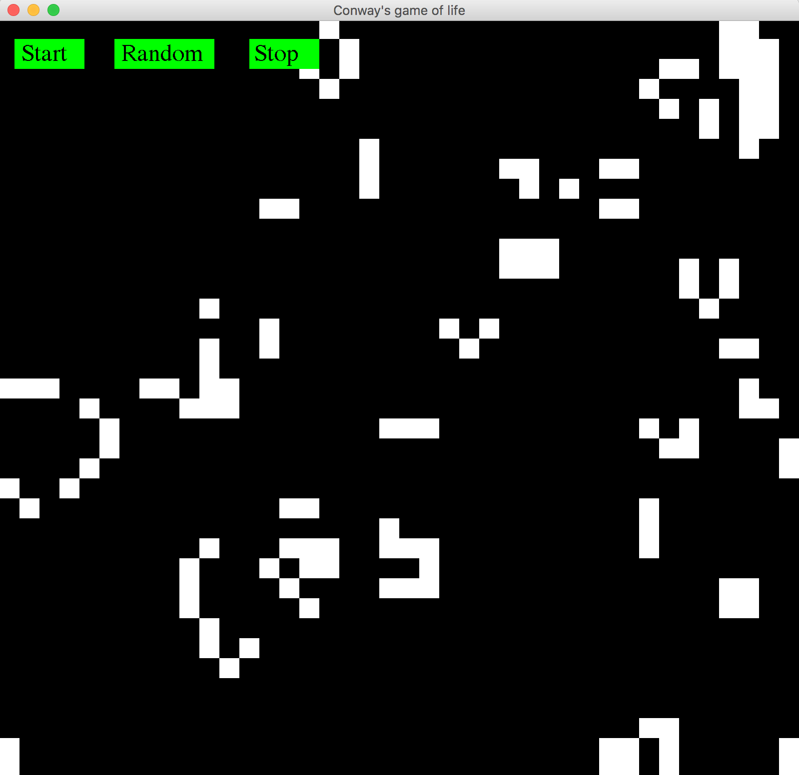

# Conways_GameOfLife
Conway's Game of Life, also known as the Game of Life or simply Life, is a cellular automaton devised by the British mathematician John Horton Conway in 1970. It is the best-known example of a cellular automaton. The "game" is actually a zero-player game, meaning that its evolution is determined by its initial state, needing no input from human players. One interacts with the Game of Life by creating an initial configuration and observing how it evolves

## Results

## Conway's rules
[1] Any live cell with fewer than 2 live neighbours dies, as if caused by under-population
[2] Any live cell with 2 or 3 live neighbours lives on to the next generation
[3] Any live cell with more than 3 neighbours dies, as if caused by overcrowding
[4] Any dead cell with exactly 3 live neighbours becomes a live cell, as if by reproduction
